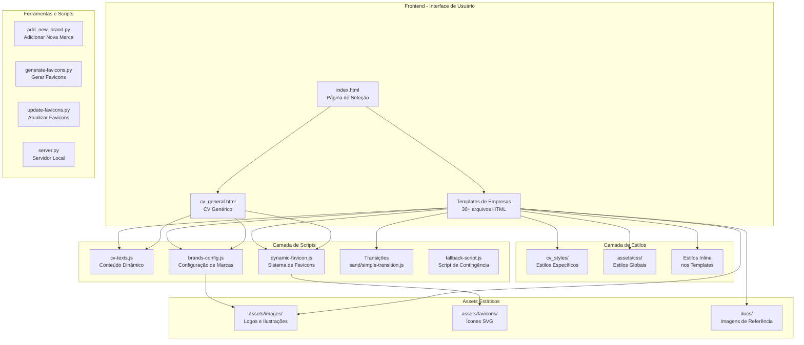
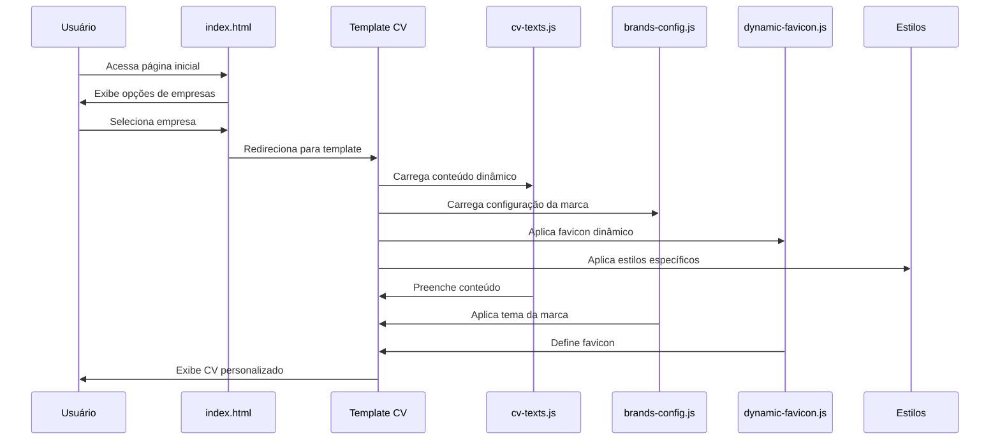
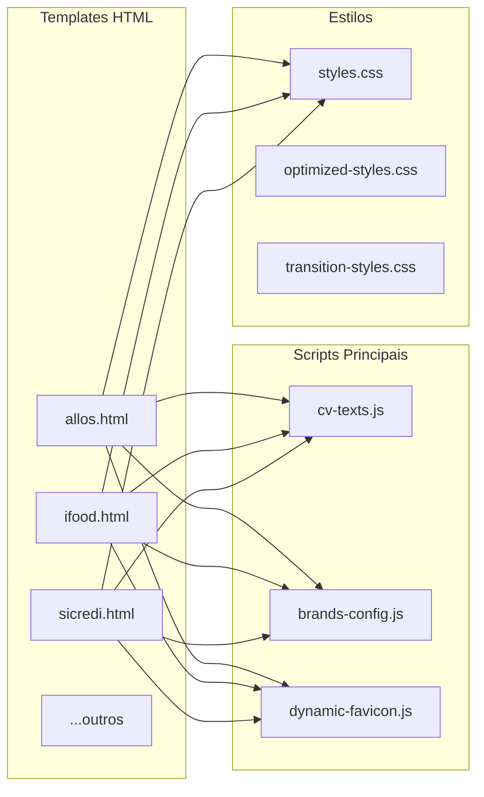
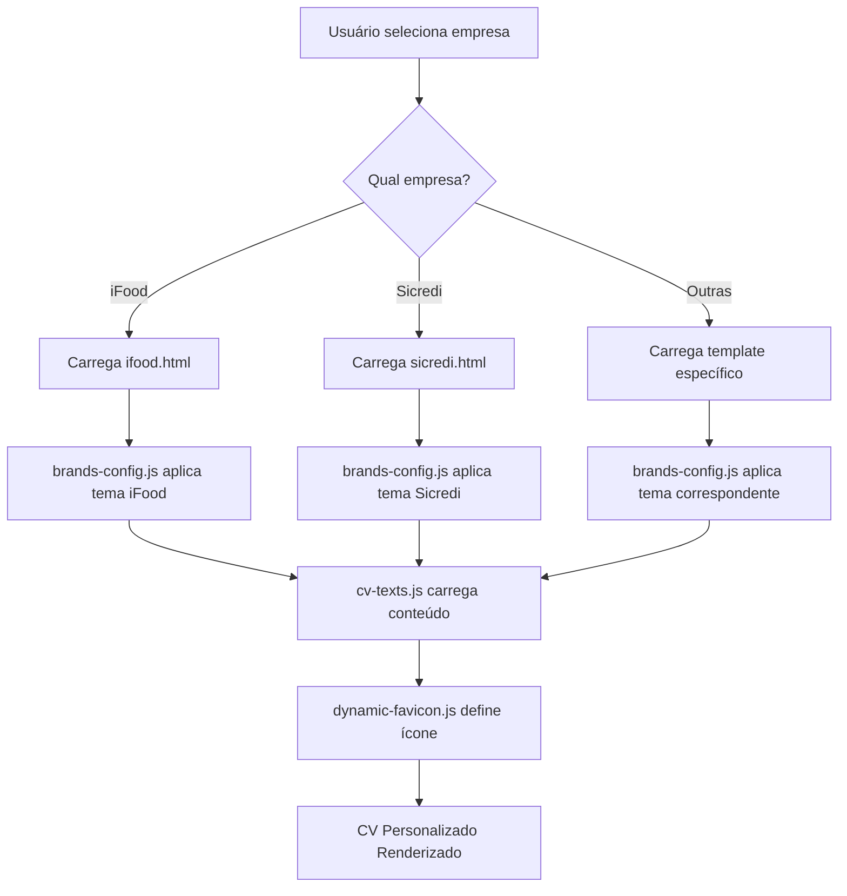

# DIAGRAMA DE COMPONENTES - PEDRO MARCONATO CV

## Visão Geral da Arquitetura



## Fluxo de Dados Detalhado



## Estrutura de Componentes

### 1. **Componente de Entrada (index.html)**
```
┌─────────────────────────────────┐
│         index.html              │
├─────────────────────────────────┤
│ • Grid de seleção de empresas  │
│ • Animações de background       │
│ • Links para templates          │
│ • Efeitos visuais (glassmorphism)│
└─────────────────────────────────┘
```

### 2. **Componentes de Template (30+ arquivos)**
```
┌─────────────────────────────────┐
│    Template de Empresa          │
├─────────────────────────────────┤
│ • Header com informações        │
│ • Seção de habilidades          │
│ • Experiência profissional      │
│ • Formação acadêmica            │
│ • Projetos e inovação           │
│ • Estilos específicos da marca  │
└─────────────────────────────────┘
```

### 3. **Sistema de Conteúdo Dinâmico**
```
┌─────────────────────────────────┐
│        cv-texts.js              │
├─────────────────────────────────┤
│ • Textos em PT/EN               │
│ • Dados de experiência          │
│ • Informações de contato        │
│ • Habilidades e ferramentas     │
│ • Funções de renderização       │
└─────────────────────────────────┘
```

### 4. **Sistema de Marcas**
```
┌─────────────────────────────────┐
│      brands-config.js           │
├─────────────────────────────────┤
│ • Configurações de 12+ marcas   │
│ • Paletas de cores              │
│ • Gradientes personalizados     │
│ • Logos e taglines              │
│ • Tipos de animação             │
└─────────────────────────────────┘
```

### 5. **Sistema de Favicons Dinâmicos**
```
┌─────────────────────────────────┐
│     dynamic-favicon.js          │
├─────────────────────────────────┤
│ • Detecção automática de marca  │
│ • Geração dinâmica de favicon   │
│ • Canvas API para renderização  │
│ • Meta tags de tema             │
└─────────────────────────────────┘
```

## Dependências entre Componentes



## Estrutura de Diretórios Simplificada

```
Pedro-Marconato-CV/
│
├── index.html                    # Entrada principal
├── cv_general.html              # Template genérico
│
├── templates/companies/         # Templates específicos
│   ├── [empresa].html          # Versão EN
│   └── [empresa]_pt.html       # Versão PT
│
├── cv_styles/                   # Estilos específicos (legado)
│   └── cv_[empresa]_style_[LANG].html
│
├── assets/
│   ├── css/                    # Estilos globais
│   ├── js/                     # Scripts principais
│   ├── images/                 # Imagens e logos
│   └── favicons/               # Ícones SVG
│
├── docs/                        # Documentação e refs
│
└── *.py                        # Scripts utilitários
```

## Fluxo de Personalização por Empresa



## Componentes Críticos

1. **cv-texts.js**: Central para todo conteúdo dinâmico
2. **brands-config.js**: Define identidade visual
3. **dynamic-favicon.js**: Experiência visual consistente
4. **Templates HTML**: Base estrutural para cada empresa

## Pontos de Extensão

- **Adicionar nova empresa**: Use `add_new_brand.py`
- **Novo idioma**: Estender cv-texts.js
- **Nova seção**: Modificar templates HTML
- **Novo estilo**: Adicionar em brands-config.js