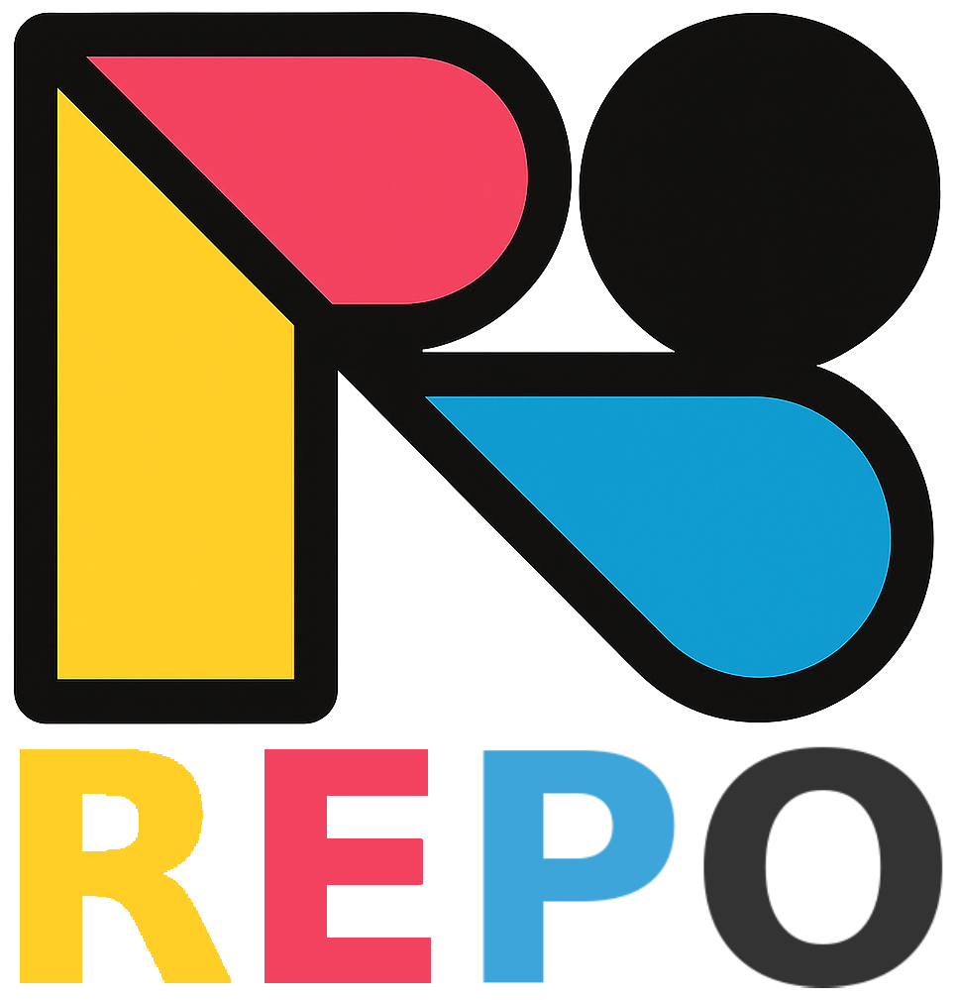

# Pedro Marconato CV

Este repositório contém a versão web do Currículo de Pedro Henrique Lima Marconato. É um projeto simples em HTML, CSS e JavaScript que apresenta o CV em formato responsivo e com transições animadas entre temas.

## Estrutura

- `index.html` – página inicial que pergunta o nome da empresa e direciona para a versão adequada do CV.
- `cv_general.html` – versão padrão do currículo.
- `sicredi.html` – versão personalizada para o Sicredi.
- `css/` – arquivos de estilos adicionais.
- `js/` – scripts JavaScript (contém o efeito de transição de areia).
- `img/` – imagens utilizadas no CV.



## Como utilizar

Clone o repositório e abra `index.html` em um navegador moderno. Caso prefira, hospede o conteúdo em um servidor HTTP simples:

```bash
python3 -m http.server
```

Então acesse `http://localhost:8000` para navegar pelas páginas.

## Licença

Os arquivos deste repositório são disponibilizados sem garantia de funcionalidade. Utilize livremente para fins de estudo.
